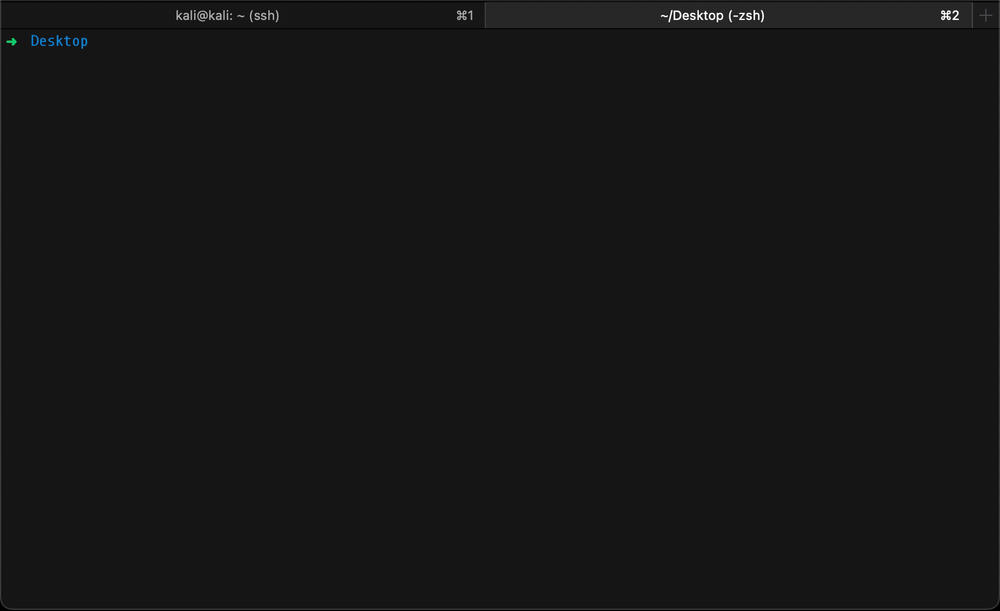

# OpenNetAdmin 18.1.1 Remote Code Execution

OpenNetAdmin 18.1.1 is prone to remote code exectution via a filter bypass in the `ip=>` paramater.
The issue could be triggered in the ping section of the application where a user could attempt to ping a server.



## Requirements:

- argparse
- urllib3
- requests
- BeautifulSoup
- termcolor

```bash
python3 -m pip install -r requirements.txt
```
